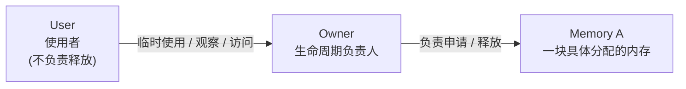
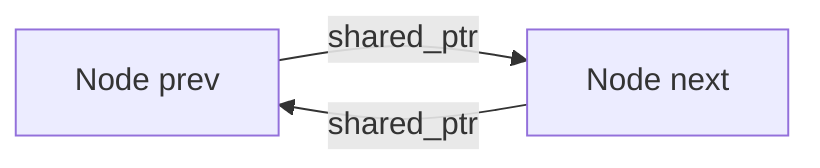

# C++ 内存与所有权

且夫天地之间，物各有主，苟非吾之所有，虽一毫而莫取。——苏轼《赤壁赋》

<user-signature/>

---
layout: image-right
image: /images/book-cover.jpg
---

## 参考书籍

> [Hands-On Design Patterns with C++](https://book.douban.com/subject/37492653/)
>
> [📖 中文版在线阅读](https://xiaoweichen.github.io/Hands-On-Design-Patterns-with-Cpp/) ｜[💻 随书源码](https://github.com/PacktPublishing/Hands-On-Design-Patterns-with-CPP-Second-Edition/)

**一本面向 C++ 特性的设计模式实践指南**

- 针对那些普遍存在的经典设计模式，介绍 C++ 特有的解决方案。
- 展示当传统设计挑战出现在泛型编程这一新领域时，所产生的 C++ 特有模式变体。
- 更新设计模式知识，与时俱进，紧跟 C++ 语言的演进步伐。

帮助我们写出 **可维护（Maintainable）、健壮（Robust）、可复用（Reusable）** 的软件系统。

---
layout: quote
---

## 本次分享涵盖主题

> 📝 参考 [第 3 章 内存与所有权](https://xiaoweichen.github.io/Hands-On-Design-Patterns-with-Cpp/3.0..html)

- 什么是内存/资源所有权？
- 设计良好的所有权长什么样？
- 何时应该对所有权“无感知”？
- 如何表达 **独占** 所有权？
- 如何表达 **共享** 所有权？
- 各种内存所有权的构造成本是什么？

💡 核心目标：让读代码的人一眼看出“谁拥有，谁负责”

---
layout: section
---

## 🏠 从一座房子开始

---
layout: two-cols-header
---

## 从一座房子开始

> 内存核心问题不是 `new / delete`，而是 **“谁对资源的存在负责”**

::left::

把资源想成一套房子 🏠：

🧑‍💼 **房东（Owner）**

- 决定是否拥有这套房子
- 决定什么时候出租、出售
- 对房子的**存在与处置**负最终责任
- 对应 C++：**资源的所有者**，负责创建与销毁

🧍 **住客（User）**

- 通过租赁关系使用房子
- 可以**退租**，但不能处置房产
- 对应 C++：**资源的使用者**，不管理生命周期

::right::

✅ 正确的秩序（理想状态）

- 房东清楚：

  > “房子是不是存在、归谁、什么时候处置，由我决定”

- 住客清楚：
  > “我只是暂时使用，用完就退租”

📌 **使用权 ≠ 所有权**

---

## 混乱从哪里来？

- ❌ **没人是房东：** 房子一直存在却没人处置

  > 👉 对应 C++：**资源被创建，但没有明确的 owner / memory leak**

- ❌ **多个房东：** 同一套房子被反复处置

  > 👉 对应 C++：**重复释放 / double free**

- ❌ **房子已处置，住客还在住：** 拿着旧钥匙进不存在的房子
  > 👉 对应 C++：**悬空指针 / use-after-free**

---
layout: two-cols-header
layoutClass: gap-2
---

## 什么是内存/资源所有权？



::left::

### 内存所有权（memory ownership）
= 负责管理某个对象及其所占内存的生命周期

但在 C++ 里我们更常说的是：

- **对象所有权**（对象活多久、谁析构它）
- **资源所有权**（对象所持有的内存 / 锁 / 文件句柄 / DB 连接等……）

> C++ 的惯用法：**让对象拥有资源** → 管资源，本质上就是管对象

::right::

### 设计良好的所有权长什么样？

一个常见误解：
> “程序每一处都需要知道谁拥有对象”

现实更合理的目标：

- **要么**清楚我是否会改变所有权
- **要么**清楚我完全不参与所有权（只是使用者）

---
layout: two-cols-header
layoutClass: gap-2
---

## 好的所有权

::left::

👀 我只是使用者，不关心谁是 owner

```cpp
struct MyValues { long a, b, c, d; };

void Reset(MyValues* v) {
  // 不关心 v 的所有者是谁，只要不搞破坏即可
  // 我不删除 v，也不延长 v 的生命周期
  v->a = v->b = v->c = v->d = 0;
```

🫴 我拿走独占所有权，但不必知道从谁那里拿的

```cpp
class A {
public:
  // 构造函数转移所有权，无论原所有者是谁
  // 不需要知道“之前谁拥有”，只需要知道“现在我拥有”
  A(std::vector<int>&& v) : v_(std::move(v)) {}
private:
  std::vector<int> v_;
};
```

::right::

🤝 共享所有权的要点也是不需要知道其他 owner

```cpp
class A {
public:
  // 不知道谁拥有 v，也不关心
  A(std::shared_ptr<std::vector<int>> v) : v_(v) {}
private:
  // 与任意数量的所有者共享所有权
  std::shared_ptr<std::vector<int>> v_;
};
```

🧹 在这段代码里，我明确负责释放

```cpp
std::unique_ptr<Widget> MakeWidget();

void Use() {
  auto w = MakeWidget();
  // 我清楚地知道自己负责 Widget 的生命周期
  DoSomething(w.get()); // 仅传递使用权
}
```

---
layout: image-right
image: /images/girl.jpeg
---

## 😊 好的所有权 - 四条标准

1. **不改变**所有权：对使用者/实现者都清晰
2. **获取独占**所有权：对使用者清晰（并能写出正确释放逻辑）
3. **共享**所有权：对使用者清晰（读代码的人一眼就能看出）
4. 每个对象在每段代码里都**明确**（不靠约定、不靠记忆、不靠猜）**是否负责**删除/释放对象

---
layout: two-cols-header
layoutClass: gap-2
---

## 坏的所有权

::left::

❓从接口读不出所有权规则

```cpp
// 谁负责 delete？
// 怎么 delete？（new/delete？malloc/free？自定义 allocator？）
// 工厂会不会自己回收？
Widget* w = MakeWidget();
```

🏭 工厂模式里最危险的“悬疑剧”

```cpp
// Factory 析构时会不会删 w？
// 使用者删了会不会 double free？
// 谁都不删会不会 leak？
WidgetFactory WF;
Widget* w = WF.MakeAnother();
```

::right::

🎭 变形术：所有权到底有没有被吞掉？

```cpp
Widget* w = MakeWidget();
// ransmogrify 删了 w → w 成悬空指针
// Transmogrify 没删 w，但你以为删了 → 泄漏
Widget* w1 = Transmogrify(w);
```

🙅 反面教材：shared_ptr 不是“免死金牌”

```cpp
// Double 并不试图延长该vector的生命周期，也不会将其所有权转移；
// 只是修改了调用者传入的vector。
void Double(std::shared_ptr<std::vector<int>> v) {
  for (auto& x : *v) x *= 2;
}
```

---
layout: section
---

## 🤔 C++ 如何表达所有权


---

## 非所有权（Non-owning）

- 最常见：大部分代码只“使用资源”，不“管理资源”。
  表达方式：原始指针 T*、引用 T&

  ```cpp
  void Transmogrify(Widget* w); // 我不会 delete w
  void MustTransmogrify(Widget& w); // 我也不会
  ```

- 非所有权的成员指针：我引用它，但我不负责它的生死

  ```cpp
  class WidgetProcessor {
  public:
    WidgetProcessor(Widget* w) : w_(w) {}
    ~WidgetProcessor() {} // 绝不删除 w_
  private:
    Widget* w_; // 非拥有
  };
  ```

  看到 raw pointer → 默认理解为“非拥有”

  前提：整个代码库遵循一致约定（否则容易混淆）

---

## 独占所有权（Exclusive ownership）

- 最优先用“栈变量”

  ```cpp
  void Work() {
    Widget w;        // 独占：作用域结束自动析构
    Transmogrify(&w);
    Draw(&w);
  }
  ```
  最清晰、最安全、最便宜

- 当必须上堆：用 unique_ptr 表达独占

  ```cpp
  class FancyWidget : public Widget { /*...*/ };

  // unique_ptr 的成本接近 raw pointer；生命周期规则清晰：离开作用域自动释放
  std::unique_ptr<Widget> w(new FancyWidget);
  ```

  典型原因：需要跨作用域存活；多态（基类指针指向派生对象）；对象太大（栈空间有限，线程栈可能只有 2MB~10MB）

---
layout: two-cols-header
layoutClass: gap-2
---

## 独占所有权的转移

::left::

🥘 工厂函数必须“逼迫接锅”
- 坏设计：工厂返回 `Widget*`
- 好设计：工厂返回 `std::unique_ptr<Widget>`

```cpp
std::unique_ptr<Widget> WidgetFactory() {
  Widget* new_w = new Widget;
  return std::unique_ptr<Widget>(new_w);
}
```

✅ 收益：编译期强制，调用方必须接管所有权；避免“没人拥有 → 泄漏”的隐形 bug。

🤔 unique_ptr 为什么能“转移”？

因为它是可移动（move）的，move 发生时所有权从 A → B，被 move 的指针进入“空/已移动状态”，不会再 delete 原对象。

::right::

🔍 栈对象的“所有权转移”：用右值引用 + std::move 明示

```cpp
void Consume(Widget&& w) {
  auto my_w = std::move(w);
  // ...
}

Widget w, w1;
Consume(std::move(w)); // 显式放弃所有权
Consume(w1);           // 编译失败：你必须明确同意 move
```

✅ 要点：std::move 的价值让“交出所有权”这件事在代码上可见，避免调用看起来像普通调用，却偷偷把对象掏空。

---
layout: two-cols-header
layoutClass: gap-2
---

## 共享所有权

::left::

### 什么是共享所有权？

多个实体 **平等地** 拥有同一个对象，对象的生命周期由**引用计数**共同决定。

⚠️ 现实问题：
- 共享所有权**极易被误用**
- “不想关心释放” ≠ “应该用共享所有权”

👉 在设计良好的系统中：
- **资源的所有权通常是明确且唯一的**
- 自动释放 ≠ 必须共享（独占指针 / 成员对象 / 容器同样能做到）

::right::

### 合理使用场景

- 底层数据结构内部节点/迭代器需要延长元素寿命
- 并发场景下，需要确保对象在操作期间不会被释放

```cpp
struct ListNode {
  T data;
  std::shared_ptr<ListNode> next, prev;
};

class ListIterator {
  std::shared_ptr<ListNode> node_;
};

class List {
  std::shared_ptr<ListNode> head_;
};
```

😊 好处：即使列表元素已从列表中断开链接，只要还能通过迭代器访问它，该元素就会继续存活。

😢 代价：引用计数维护；初次创建需要控制块分配（可用 make_shared 优化）。

---
layout: two-cols-header
layoutClass: gap-2
---

## 共享所有权的代价与风险

::left::

### 循环依赖 / 引用风险

双向链表若 next 和 prev 都是 shared_ptr：

- 相邻节点互相拥有
- 双方都从链表中删除也不会释放 → 内存泄漏



😱 结果：next 和 prev 的引用计数永远 > 0，内存永生。

😊 解决方案：一方使用 `std::weak_ptr`，不增加引用计数，但能安全探测对象是否还活着。

👉 “我认识你，但不负责你”

::right::

### 性能成本

- 复制/析构：原子增减引用计数
- 控制块：额外内存 + 初始化成本
- 并发：线程安全的共享指针更复杂，运行时成本更高

### 设计信号

😮‍💨 滥用往往意味着：所有权设计不清晰

---
layout: section
---

## ⚔️ 实战

---

## 实战题 1：接口是否“写清楚了所有权”？

🤔 以下代码有问题吗？

````md magic-move
```cpp
Buffer* LoadFile(const std::string& path);

void Use() {
  auto buf = LoadFile("data.bin");
  Process(buf);
}
```
```cpp
// 问题：谁负责释放返回值？
Buffer* LoadFile(const std::string& path);

void Use() {
  auto buf = LoadFile("data.bin");
  Process(buf);
  // delete ? 不 delete ?
}
```
````
<div v-click>

🧐 问题分析：

- 调用者必须去“翻实现 / 看文档 / 问作者”
- 工厂函数 + raw pointer = 所有权不透明
- 很容易在重构中引入：泄漏 / double free / use-after-free

</div>

---

## 实战题 1：接口是否“写清楚了所有权”？

🤔 应该如何修改？

````md magic-move
```cpp
// 问题：谁负责释放返回值？
Buffer* LoadFile(const std::string& path);

void Use() {
  auto buf = LoadFile("data.bin");
  Process(buf);
  // delete ? 不 delete ?
}
```
```cpp
std::unique_ptr<Buffer> LoadFile(const std::string& path);

void Use() {
  auto buf = LoadFile("data.bin");
  Process(buf);
  // delete ? 不 delete ?
}
```
```cpp
std::unique_ptr<Buffer> LoadFile(const std::string& path);

void Use() {
  auto buf = LoadFile("data.bin");
  Process(buf.get()); // 只借用
} // 自动释放
```
````

<div v-click>

😊 为什么这是好设计：

- 所有权在类型中显式表达
- 调用方在编译期被迫接锅
- 不需要注释，也不需要约定

</div>

---

## 实战题 2：函数调用中是否“偷偷改变了所有权”？

🤔 以下代码有问题吗？

````md magic-move
```cpp
void Register(Widget* w) {
  widgets_.push_back(std::unique_ptr<Widget>(w));
}

Widget* w = new Widget;
Register(w);
Use(w);
```
```cpp
void Register(Widget* w) {
  widgets_.push_back(std::unique_ptr<Widget>(w));
}

Widget* w = new Widget;
Register(w);
// w 现在还活着吗？
Use(w); // 悬空指针风险
```
````

<div v-click>

🧐 问题分析：

- 函数名、参数完全看不出 Register 会“吞掉”所有权
- 调用点极其危险，但代码看起来“很正常”

</div>

---

## 实战题 2：函数调用中是否“偷偷改变了所有权”？

🤔 应该如何修改？

````md magic-move
```cpp
void Register(Widget* w) {
  widgets_.push_back(std::unique_ptr<Widget>(w));
}

Widget* w = new Widget;
Register(w);
// w 现在还活着吗？
Use(w); // 悬空指针风险
```
```cpp
void Register(std::unique_ptr<Widget> w) {
  widgets_.push_back(std::move(w));
}

Widget* w = new Widget;
Register(w);
// w 现在还活着吗？
Use(w); // 悬空指针风险
```
```cpp
void Register(std::unique_ptr<Widget> w) {
  widgets_.push_back(std::move(w));
}

auto w = std::make_unique<Widget>();
Register(std::move(w)); // 明确：我放弃所有权
```
````

<div v-click>

😊 为什么这是好设计：

- `std::move` 是心理确认按钮（主动放弃）
- 调用点可读性极强
- 编译器帮助你阻止误用

</div>

---

## 实战题 3：shared_ptr 是“共享所有权”，还是“共享误解”？

🤔 以下代码有问题吗？

````md magic-move
```cpp
void Normalize(std::shared_ptr<Image> img) {
  img->Normalize();
}
```
```cpp
// 问题：Normalize 需要延长 img 的生命周期吗？
void Normalize(std::shared_ptr<Image> img) {
  img->Normalize(); // 只是使用了 img
}
```
````

<div v-click>

🧐 问题分析：

- 函数并没有延长 img 的生命周期，却修改了引用计数
- 语义被放大：“这个函数是不是要活得很久？”

</div>

---

## 实战题 3：shared_ptr 是“共享所有权”，还是“共享误解”？

🤔 应该如何修改？

````md magic-move
```cpp
// 问题：Normalize 需要延长 img 的生命周期吗？
void Normalize(std::shared_ptr<Image> img) {
  img->Normalize(); // 只是使用了 img
}
```
```cpp
// 带有共享语义的“使用/借用”
void Normalize(const std::shared_ptr<Image>& img) {
  img->Normalize();
}
```
```cpp
// 或者更纯粹的表达“只是使用”，不关心所有权
void Normalize(Image& img) {
  img.Normalize();
}
```
````

<div v-click>

😊 为什么这是好设计：

- 非拥有访问，语义精确
- 零运行时成本
- 读者清晰地知道，不用担心生命周期变化

</div>

---
layout: two-cols-header
layoutClass: gap-2
---

## 实战题 4：跨层对象，谁才是真正的 Owner？

::left::

🤔 以下代码有问题吗？

````md magic-move
```cpp
// Model 表示业务状态
class Document {
public:
  void SetDirty();
};

// View 负责展示
class DocumentView {
public:
  explicit DocumentView(const std::shared_ptr<Document>& doc)
    : doc_(doc) {}

private:
  std::shared_ptr<Document> doc_;
};

// Controller 销毁 Model
DocumentController::~DocumentController()
{
  document_.reset();
}
```
```cpp
// Model 表示业务状态
class Document {
public:
  void SetDirty();
};

// View 负责展示
class DocumentView {
public:
  explicit DocumentView(const std::shared_ptr<Document>& doc)
    : doc_(doc) {}

private:
  std::shared_ptr<Document> doc_;
};

// Controller 销毁 Model
DocumentController::~DocumentController()
{
  document_.reset(); // 以为 Document 会销毁，实际却被 View 层影响
}
```
````

::right::

<div v-click>

🧐 问题分析：

- DocumentView 无意中拥有了 Document
- Model 生命周期 被 View 延长
- Controller 已销毁，但 Model 仍存活
- 视图层偷偷参与了业务对象的生死决策

</div>

---
layout: two-cols-header
layoutClass: gap-2
---

## 实战题 4：跨层对象，谁才是真正的 Owner？

::left::

🤔 应该如何修改？

````md magic-move
```cpp
// Model 表示业务状态
class Document {
public:
  void SetDirty();
};

// View 负责展示
class DocumentView {
public:
  explicit DocumentView(const std::shared_ptr<Document>& doc)
    : doc_(doc) {}

private:
  std::shared_ptr<Document> doc_;
};

// Controller 销毁 Model
DocumentController::~DocumentController()
{
  document_.reset(); // 以为 Document 会销毁，实际却被 View 层影响
}
```
```cpp
// Model 表示业务状态
class Document {
public:
  void SetDirty();
};

// View 负责展示
class DocumentView {
public:
  explicit DocumentView(const std::shared_ptr<Document>& doc)
    : doc_(doc) {}

private:
  std::weak_ptr<Document> doc_; // 只观察，不拥有
};

// Controller 销毁 Model
DocumentController::~DocumentController()
{
  document_.reset(); // Document 正常销毁
}
```
````

::right::

<div v-click>

😊 为什么这是好设计：

- Document 的 Owner 是 Controller / Application
- View 只负责展示，不决定对象是否存在
- Model 销毁 ⇒ View 自动失效
- weak_ptr 明确表达不掌控生命周期

</div>

---

## 把所有权写进类型，让读者不用猜

我们在代码里需要 **清晰** 表达四件事：使用（non-owning）、独占（exclusive）、转移（move）、共享（shared）

<scrollable-table maxHeight="400px" stickyHeader>

| **使用场景 / 需求** | **推荐类型** | **所有权语义（工程读法）** |
| --- | --- | --- |
| 非拥有访问（可空） | `T*` | **借用**：对象必须在调用期间存活，可为空 |
| 非拥有访问（不可空） | `T&` | **借用**：对象必须在调用期间存活，不可为空 |
| 独占拥有（自动存储期） | `T` | **我拥有**：作用域结束自动析构 |
| 独占拥有（动态分配） | `std::unique_ptr<T>` | **我拥有**：负责释放，生命周期明确 |
| 独占所有权转移 | `std::unique_ptr<T>（move）/ T&& + std::move` | **我放弃 → 你接管**：所有权转移在代码中可见 |
| 共享拥有 | `std::shared_ptr<T>` | **我们共同拥有**：通过引用计数管理生命周期 |
| 共享体系中的借用 ⚠️ | `const std::shared_ptr<T>&` | **不增加引用计数，但依赖共享所有权体系** |
| 打破共享环 / 观测 | `std::weak_ptr<T>` | **只观察**：不拥有，不延长生命周期 |

</scrollable-table>

---
layout: intro
---

## 结束语

内存所有权其实是对象所有权的简称，而对象所有权是资源所有权的载体。

现代 C++ 提供了成熟的惯用法，让“谁负责释放”从注释和脑补变成类型系统的一部分。

更有意思的“对象与视图”部分就等各位自行探索了～

谢谢 👋